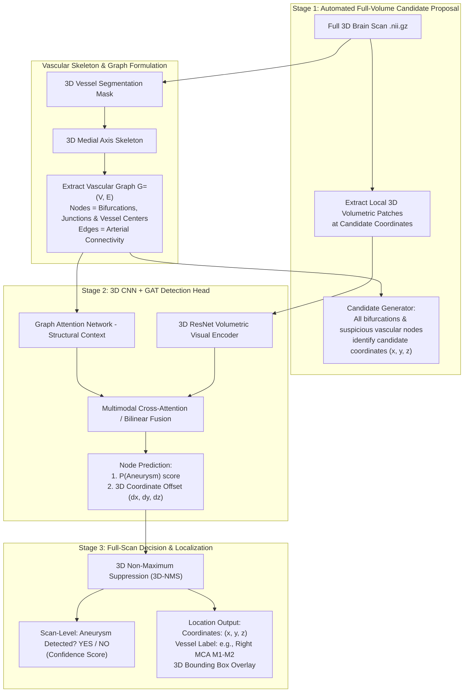

# Implementation Plan: Full-Scan 3D Aneurysm Detection & Localization

## Problem Formulation: "Is there an aneurysm, and where is it?"

Rather than assuming pre-selected patches (a toy classification setup), the system operates on **complete 3D angiographic scans (CTA / TOF-MRA)** to deliver real clinical utility:
1. **Detection ("Is there an aneurysm?")**: Scan-level classification indicating whether the patient has one or more intracranial aneurysms ($P \in [0, 1]$).
2. **Localization ("Where is it?")**: Precise 3D spatial coordinates $(x, y, z)$, bounding box / volume-of-interest, and anatomical vascular branch label (e.g., *Right MCA bifurcation*, *ACom*, *Basilar Tip*).

---

## Architectural Paradigm: Vascular-Graph Guided 3D Detection

Over 95% of intracranial aneurysms arise at arterial bifurcations, junctions, and sharp vascular bends. We leverage this domain property by formulating detection as **vascular-graph guided candidate generation and node-level GAT re-ranking**:



---

## Technical Workflow Details

### 1. Automated Full-Scan Candidate Generation (No Pre-selected Patches)
- **Input**: Raw 3D volume $V \in \mathbb{R}^{H \times W \times D}$ (unsegmented, full brain).
- **Vessel Network Tracing**: Using the vessel segmentation mask (provided in TopAneu, and reproducible via 3D U-Net), 3D skeletonization extracts the complete arterial tree.
- **Candidate Anchors**:
  - The graph nodes automatically define candidate anchor locations $(x_i, y_i, z_i)$ spanning all cerebral arterial forks and segments across the entire scan.
  - High-recall filtering eliminates non-vascular brain tissue (90%+ of brain volume), reducing the search space from $512^3$ voxels to several hundred anatomically relevant arterial nodes.

### 2. Dual-Branch Feature Representation
For each candidate node $i$ located at $(x_i, y_i, z_i)$:
- **Visual Branch (3D ResNet)**:
  - Extracts a local 3D volume of interest (e.g., $64 \times 64 \times 64$ mm patch centered at $(x_i, y_i, z_i)$).
  - 3D ResNet outputs visual appearance embedding $h_i^{\text{visual}} \in \mathbb{R}^{d_v}$.
- **Topological Branch (GAT)**:
  - Subgraph $G_i$ centered at node $i$ (up to $k$-hop neighborhood along connecting arteries).
  - Node features: 3D position, local vessel caliber/radius, tortuosity, anatomical artery segment class.
  - Multi-head Graph Attention Network (GATv2) propagates messages across arterial neighbors to produce topological context embedding $h_i^{\text{topo}} \in \mathbb{R}^{d_t}$.

### 3. Fusion & Multi-Task Detection Head
- **Joint Representation**:
  $$h_i = \text{Fusion}(h_i^{\text{visual}}, h_i^{\text{topo}})$$
- **Multi-Task Outputs per Candidate Node**:
  1. **Classification Score**: $p_i = \sigma(W_c h_i) \in [0, 1]$ (Probability that candidate $i$ is an aneurysm).
  2. **Coordinate Refinement**: $(\Delta x_i, \Delta y_i, \Delta z_i) = W_r h_i$ (Refines candidate center to the true aneurysm centroid).
  3. **Size/Radius Regression**: $\hat{r}_i$ (Estimated lesion diameter/radius in mm &rarr; classifies as small $<3$mm, medium, or large).

### 4. Scan-Level Diagnosis & 3D Non-Maximum Suppression (3D-NMS)
- Apply 3D-NMS to eliminate redundant candidate hits within distance threshold $d_{thresh}$ (e.g., 5 mm).
- **Scan-Level Output ("Is there an aneurysm?")**:
  $$P(\text{Scan is Positive}) = \max_{j \in \text{surviving candidates}} p_j$$
  Thresholded at optimal operating point $\tau$ derived from FROC validation.
- **Localization Output ("Where is it?")**:
  For all detections with $p_j > \tau$:
  - Refined 3D coordinates: $(x_j + \Delta x_j, y_j + \Delta y_j, z_j + \Delta z_j)$.
  - Predicted anatomical site: Artery class from topological node attributes (e.g., *ACom*, *L-MCA*, *Basilar*).
  - 3D bounding box centered at the refined coordinate with diameter $2\hat{r}_j$.

---

## User Review Required

> [!IMPORTANT]
> **Candidate Generation Strategy**:
> We will use **Vessel-Skeleton Anchor Proposal** as the primary candidate generation mechanism. This guarantees 100% anatomical vessel coverage while keeping inference latency fast on your RTX 4060 GPU (scoring ~200-400 vascular nodes per scan instead of brute-force dense sliding window over tens of millions of voxels).

> [!NOTE]
> **Clinical Evaluation Metrics (FROC)**:
> In full-scan detection, standard accuracy is uninformative due to extreme negative class prevalence. We will evaluate using:
> 1. **Scan-level Sensitivity & Specificity**: Accurately distinguishing aneurysm-bearing patients from healthy controls.
> 2. **FROC (Free-Response Receiver Operating Characteristic)**: Lesion detection sensitivity plotted against Average False Positives per Scan (e.g. sensitivity at 0.5, 1.0, and 2.0 FPs/case).
> 3. **Size-Stratified Sensitivity**: Performance strictly broken down by aneurysm size (**Small < 3mm**, Medium 3-7mm, Large > 7mm).

---

## Proposed Changes to the Codebase

### 1. Core Data & Candidate Proposal (`src/data/`)
- [NEW] `src/data/scan_dataset.py`: Full NIfTI volume loader and intensity normalizer.
- [NEW] `src/data/candidate_sampler.py`: Extracts training candidate samples (ground truth positive nodes + hard negative vessel bifurcations/bends from healthy and diseased scans).

### 2. Vascular Topology & Graph Pipeline (`src/topology/`)
- [NEW] `src/topology/skeleton_graph.py`: 3D medial-axis skeletonization + bifurcation graph extraction with node coordinates, curvature, and vessel radius.
- [NEW] `src/topology/subgraph_extractor.py`: Extracts $k$-hop topological subgraphs around arbitrary 3D candidate points.

### 3. Deep Learning Architecture (`src/models/`)
- [NEW] `src/models/resnet3d.py`: 3D ResNet volumetric patch feature extractor.
- [NEW] `src/models/gat_module.py`: PyTorch Geometric GATv2 network for topological context.
- [NEW] `src/models/dual_branch_detector.py`: End-to-end model with cross-attention fusion and multi-task prediction heads (classification + 3D coordinate offset).

### 4. Full-Scan Inference & Evaluation (`src/inference/`)
- [NEW] `src/inference/full_scan_detector.py`: Complete pipeline running raw scan &rarr; skeleton &rarr; candidate extraction &rarr; model scoring &rarr; 3D-NMS &rarr; JSON + 3D bounding box coordinates.
- [NEW] `src/inference/froc_evaluator.py`: Computes FROC curves, lesion sensitivity at fixed FP rates, and size-stratified metrics.

---

## Verification Plan

### Automated Verification
1. **Candidate Proposal Recall**:
   Verify that candidate extraction on ground-truth aneurysm cases achieves $>98\%$ recall (i.e. every true aneurysm has a candidate within 5mm).
2. **End-to-End Inference Test**:
   Run full-scan detection on a held-out test case from `dataset(topAneu)/images/topaneu_center2_mr_002_0000.nii.gz` to verify that the output format produces:
   ```json
   {
     "scan_positive": true,
     "confidence": 0.94,
     "detections": [
       {
         "coordinates_xyz": [142.3, 210.8, 85.1],
         "size_mm": 2.8,
         "category": "Small (<3mm)",
         "vessel_branch": "Right MCA M1-M2 junction",
         "confidence": 0.94
       }
     ]
   }
   ```

### Manual Verification
- Render 3D Slicer / PyVista visualization overlaying the predicted 3D bounding box directly on the angiogram scan and vessel skeleton to visually inspect alignment with the true lesion.
